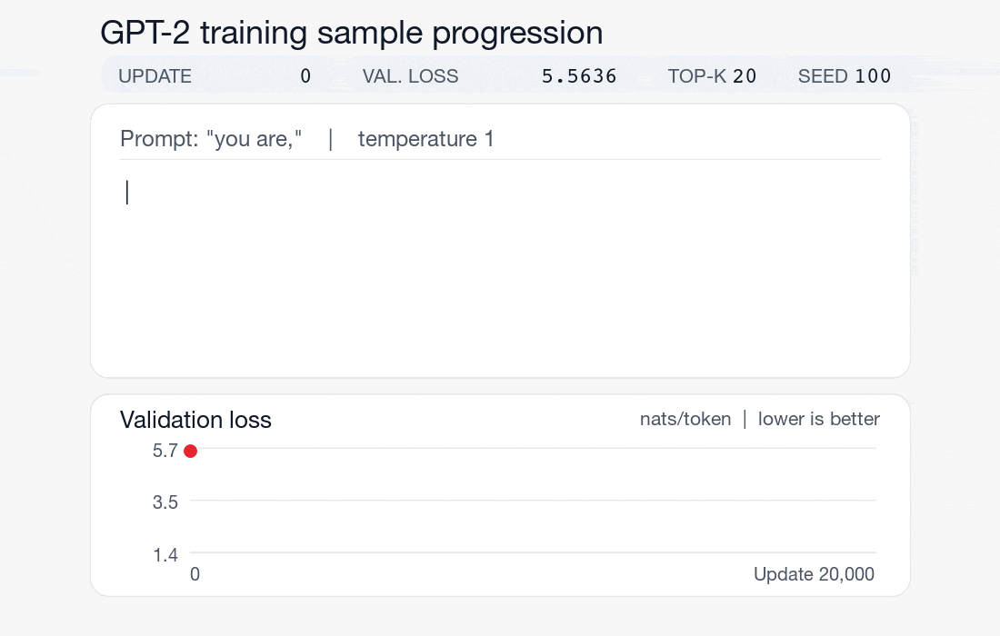
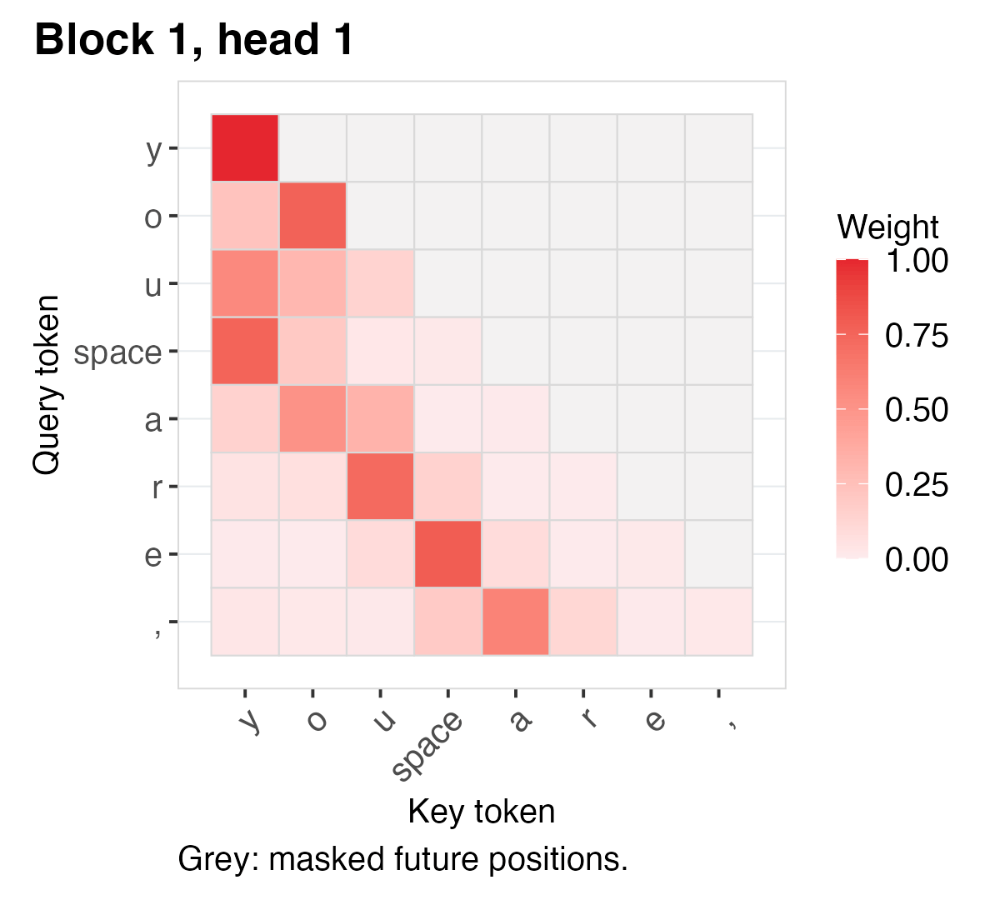

# GPT-2-style language model from scratch in R

A small, CPU-only **decoder-only Transformer** implemented directly in R. 
This project follows our [character-level RNN](https://github.com/switzerlandomics/src-min_char_rnn_r) and [single-head Transformer](https://github.com/switzerlandomics/src-min_char_transformer_r), and shows how multi-head causal attention, independently parameterised stacked blocks, GELU feed-forward layers and tied input/output embeddings predict the next token.

We train and test on `tiny_shakespeare.txt`.

This is an **architectural reproduction** inspired by OpenAI's GPT-2 pretraining pipeline but is not directly read to scale for hight language quality.

### Training progression

The model's generated text becomes more structured as training progresses. Each sample uses the same prompt and sampling settings.



### Attention across Transformer blocks

The following animation shows the attention patterns learned by the model.




## Scope and dependencies

The model implements its forward pass, complete manual backward pass, next-token cross-entropy, Adam updates, numerical gradient checks, held-out validation, checkpointing and uncached autoregressive sampling in ordinary R matrices and arrays. It currently uses **individual UTF-8 bytes**, with 256 one-based token IDs. 
GPT-2's byte-level BPE and key-value-cached generation are future, separate steps. No deep-learning framework, automatic differentiation, pretrained neural weights or packaged Transformer layers are used for training.

`ggplot2` is optional for saved figures; `svglite` is optional for editable SVG publication figures. Neither package is required to train or evaluate the model.
Install the plotting packages if you don't have:

```r
install.packages(c("ggplot2", "svglite"))
```

## Quick start

Run these commands from the repository root:

```sh
Rscript tests/test_tokenizer.R
Rscript tests/test_model.R
Rscript tests/test_gradients.R
Rscript tests/test_training.R
Rscript experiments/run.R --iterations=100
```

`data/input.txt` is a small offline smoke-test corpus, not a meaningful
language-modelling benchmark. Supply your own local copy of Tiny Shakespeare at `data/tiny_shakespeare.txt` for a longer experiment:

```sh
Rscript experiments/run.R \
  --input=data/tiny_shakespeare.txt \
  --iterations=2000 \
  --context-length=32 \
  --embedding-size=32 \
  --n-heads=4 \
  --n-layers=2 \
  --batch-size=2 \
  --validation-interval=100 \
  --checkpoint-interval=500 \
  --plot-detailed
```

Use `Rscript experiments/run.R --help` for the complete set of options.
Training uses the CPU and may be slower than a framework/GPU implementation.
No training duration or generated-text quality target is guaranteed.


## Heaviest runs

The initial 2,000-update experiment completed in approximately 1 minute on one laptop CPU. The following two configurations provide a progression towards longer-context learning and a larger GPT-2-style model. Runtime estimates are approximate, based on that initial run; CPU performance and validation overhead will affect the actual duration.

Intermediate run — aim for approximately 5 minutes. Increase the context from 32 to 48 tokens, the embedding size from 32 to 48, and the number of training updates from 2,000 to 4,000. Keep two blocks, four heads and the same batch size so the architectural changes remain easy to interpret.

<!-- Private example may not be visible to readers (20260922_163712) -->
```sh
Rscript experiments/run.R \
  --input=data/tiny_shakespeare.txt \
  --iterations=4000 \
  --context-length=48 \
  --embedding-size=48 \
  --n-heads=4 \
  --n-layers=2 \
  --batch-size=2 \
  --validation-interval=200 \
  --checkpoint-interval=1000 \
  --plot-detailed
```

Larger run — allow approximately 1–2 hours, potentially longer. Increase the context to 64 tokens, embedding size to 64, depth to three blocks, and batch size to four. Use 10,000 updates to give this larger model more opportunities to learn. Retaining four heads increases each head’s feature dimension from 8 in the original run to 16 here, without changing the number of heads.


<!-- Private example may not be visible to readers (20260922_165202) -->
```sh
Rscript experiments/run.R \
  --input=data/tiny_shakespeare.txt \
  --iterations=10000 \
  --context-length=64 \
  --embedding-size=64 \
  --n-heads=4 \
  --n-layers=3 \
  --batch-size=4 \
  --validation-interval=500 \
  --checkpoint-interval=1000 \
  --plot-detailed
```

The larger run does substantially more computation per update, as well as performing more updates. It should not be expected to finish in five times the duration of the original run simply because it has five times as many updates. Start with the intermediate run to establish a timing reference on your own machine before committing to the larger one.

Both configurations save metrics, a live training figure and resumable checkpoints during training. Detailed attention and prediction figures are generated at the end. These experiments use the same byte-token vocabulary, but changing the context length also changes the validation windows, so their reported validation losses are not a strictly controlled model-size comparison.

The command above is a 10,000-update run that took about an hour. Use its validation curve and best-validation update to decide what to change next. There are two sensible paths.

If validation loss was still decreasing near update 10,000, train the same model longer first. This is the cleanest experiment: it tells us whether the current architecture still has more to learn, without introducing another variable. The runner supports resuming with a higher total update count:

```sh
Rscript experiments/run.R \
  --resume=output/YOUR_RUN_DIRECTORY \
  --iterations=20000 \
  --plot-detailed
```

This continues from the latest checkpoint rather than starting again. Check whether the best validation loss improves; a lower training loss alone is not sufficient evidence of better generalisation.

If validation loss had largely levelled off, my next architecture experiment would be `--embedding-size=96`. Keep the context length, number of blocks, heads, batch size and updates unchanged. This increases the representation size from 64 to 96, giving each of the four heads 24 features instead of 16, while allowing a relatively clear comparison with the previous run.

```sh
Rscript experiments/run.R \
  --input=data/tiny_shakespeare.txt \
  --iterations=10000 \
  --context-length=64 \
  --embedding-size=96 \
  --n-heads=4 \
  --n-layers=3 \
  --batch-size=4 \
  --validation-interval=500 \
  --checkpoint-interval=1000 \
  --plot-detailed
```

Allow roughly 2–3 hours as a planning estimate, not a benchmark: wider embeddings increase computation throughout attention and the feed-forward layers.

I would not increase context length, width, depth and batch size together yet. Changing one variable at a time makes it much easier to see what improved or failed to improve. If the wider model helps but generated passages still lose coherence over longer spans, increasing `--context-length` from 64 to 128 would be a logical subsequent experiment, although it will make CPU training substantially more expensive.

My largest test was the following model to 20,000 total updates with with context length 96. 
Beyond this I recommend keeping the architecture fixed and try a larger (~10 MB) corpus with more training updates. The Tiny Shakespeare is about 1MB. The Gutenberg project has a complete Shakespeare works txt of ~7MB.

```sh
Rscript experiments/run.R \
  --input=data/tiny_shakespeare.txt \
  --iterations=20000 \
  --context-length=96 \
  --embedding-size=96 \
  --n-heads=4 \
  --n-layers=3 \
  --batch-size=4 \
  --validation-interval=500 \
  --checkpoint-interval=1000 \
  --plot-detailed
```

## Monitoring and publication figures

`--plot` refreshes `training.png` at every validation measurement while the experiment continues. `metrics.csv` and resumable checkpoints are saved independently of plotting. The training series is loss from sampled windows; validation measures fixed held-out windows. Neither series is smoothed.

`--plot-detailed` **implies `--plot`**. After training it uses the saved best-validation checkpoint and the same short validation prompt to create:

| Output under `output/YOUR_RUN/detailed/` | Measured content |
|---|---|
| `training_detail.png` and optionally `.svg` | Learning history and selected checkpoint. |
| `next_token_probabilities.png` and optionally `.svg` | Token probabilities from the selected model, compared with the initial model when available. |
| `attention_block_01_head_01.png` and optionally `.svg`, etc. | One compact attention matrix for **every head in every block**. All use the same 0–1 scale; grey cells indicate masked future positions. |

The main output directory also contains a compact `attention.png` for the first head of the first block, generated at the end of the run. 
Detailed figures are not recalculated at every training update. Plotting failures produce warnings, not training failures. If `svglite` is absent, detailed PNGs are still saved.

To produce detailed plots for an already completed run without further updates:

```sh
Rscript experiments/run.R \
  --resume=output/YOUR_RUN \
  --iterations=2000 \
  --plot-detailed
```

Set `--iterations` to that run's saved **total** update count. The selected model is chosen by validation loss, not by sample readability. Older runs without `initial_model.rds` show only the selected model's next-token probabilities; missing initial predictions are not reconstructed.

## Tokenizer - From text to training data

The model uses a byte-level tokenizer: each UTF-8 byte becomes one of 256 token IDs (byte value + 1 for R’s one-based indexing). For example, `"you are,"` becomes eight tokens. This is not yet GPT-2’s byte-pair encoding (BPE).


We have added a demonstration script `experiments/inspect_tokenizer.R` which uses the project’s actual tokenizer `R/tokenizer.R` and batching functions to show how text becomes token IDs, how Tiny Shakespeare is split into training and validation data, and how each training input is paired with its next-byte target. You can run it with this:

```sh
Rscript experiments/inspect_tokenizer.R \
  --input=data/tiny_shakespeare.txt \
  --text="you are," \
  --context-length=8 \
  --start=1 \
  --output=output/tokenization.md
```

[View the tokenisation report](/output/tokenization.md), including the byte-by-byte tables and a real training window: input `"First Ci"` → targets `"irst Cit"`.

## Reproducibility and outputs

Each dated run under `output/` records its original command, resolved options, corpus checksum, best-validation model, complete resumable checkpoint, metrics and a model-generated sample. `experiment.log` reproduces the concise console progress reports with elapsed time and an ETA measured from the current session.
On resume, the corpus checksum is checked, and only the total iteration target and plotting flags may change. Saving the complete checkpoint at validation also keeps model-selection metadata and recoverable training history aligned.

```text
output/YOUR_RUN/
├── run_command.txt
├── corpus_checksum.txt
├── experiment.log
├── metrics.csv
├── initial_model.rds
├── best_model.rds
├── latest_checkpoint.rds
├── sample.txt
├── training.png                      # With --plot
├── attention.png                     # With --plot
└── detailed/                         # With --plot-detailed
    ├── training_detail.png            # Plus .svg if svglite is installed
    ├── next_token_probabilities.png   # Plus .svg if svglite is installed
    ├── attention_block_01_head_01.png # Plus .svg if svglite is installed
    └── ...                            # One pair per block and head
```

The test portion of the corpus is held aside and is not used for ordinary checkpoint selection. The original training corpus remains on your machine.

## Repository structure

```text
R/tokenizer.R           Byte-token encoder and decoder
R/data.R                Raw corpus I/O, splits and batches
R/model.R               Parameters, GPT-2-style forward and manual backward
R/optimiser.R           Adam and global gradient-norm clipping
R/evaluation.R          Held-out loss and autoregressive generation
R/plots.R               Optional measured monitoring and publication figures
R/progress.R            Human-readable logs, session ETA and file-writing helpers
experiments/run.R       Reproducible training, checkpointing and plotting options
tests/                  Tokeniser, shape, gradient and training checks
data/                   Offline example and corpus instructions
docs/                   Model and optional figure-design notes
output/                 Local experiment artefacts, excluded from Git
```

The model's array convention is `[batch, time, features]` and its identifiers use general names such as `token_ids`, `targets`, `parameters` and `gradients`.
The causal mask is applied to scores **before softmax**; the output projection shares the token-embedding matrix and accumulates gradients from both uses.

## Thoughts

* An interesting thought: the initial random model and the final trained model contain the same architecture and number of parameters, so their files are essentially the same size. Like a ship in a bottle, the same components can form either a carefully constructed ship or an unassembled mess—the difference lies in how they are arranged.

* Our `best_model.rds` is the trained model checkpoint, analogous to the weights of an open-weights model on Hugging Face. To run it locally, we also need the matching model implementation, configuration and tokenizer. In this project, those are provided by our R code; the weights alone are not a standalone program.

* Like other open-weights models, our trained checkpoint must be used with its matching architecture and tokenizer. We store these in R’s native format; Hugging Face models commonly distribute trained weights in `safetensors` format, alongside configuration files, tokenizer files and a model card explaining how to use them.

## Primary references

- Radford A, Wu J, Child R, Luan D, Amodei D, Sutskever I. Language models are unsupervised multitask learners. OpenAI blog. 2019 Feb 24;1(8):9. [*Language Models are Unsupervised Multitask Learners*](https://cdn.openai.com/better-language-models/language_models_are_unsupervised_multitask_learners.pdf).
- OpenAI's [original GPT-2 repository](https://github.com/openai/gpt-2),
  particularly [`src/model.py`](https://github.com/openai/gpt-2/blob/master/src/model.py),
  [`src/encoder.py`](https://github.com/openai/gpt-2/blob/master/src/encoder.py)
  and [`src/sample.py`](https://github.com/openai/gpt-2/blob/master/src/sample.py).
- [Released GPT-2 weights and model card](https://huggingface.co/openai-community/gpt2), relevant to optional future compatibility testing, not this project's training.
- <https://openai.com/index/better-language-models/>
- <https://openai.com/index/gpt-2-6-month-follow-up/>
- <https://openai.com/index/gpt-2-1-5b-release/>
- <https://huggingface.co/openai-community/gpt2>

